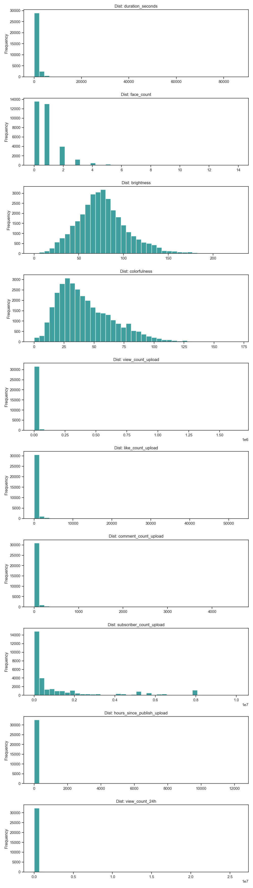
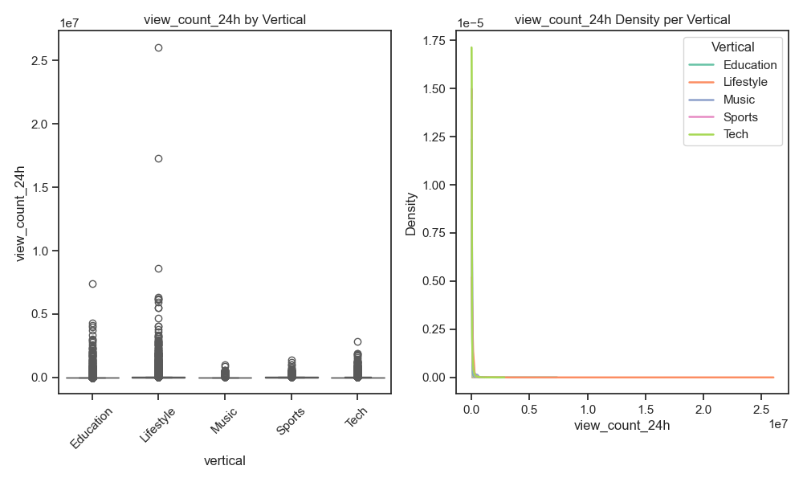
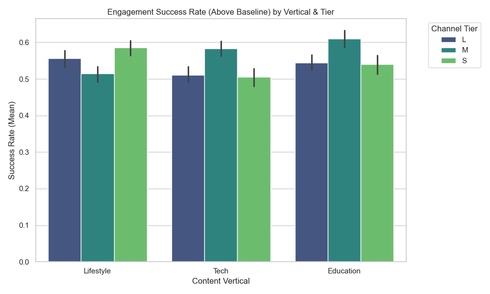
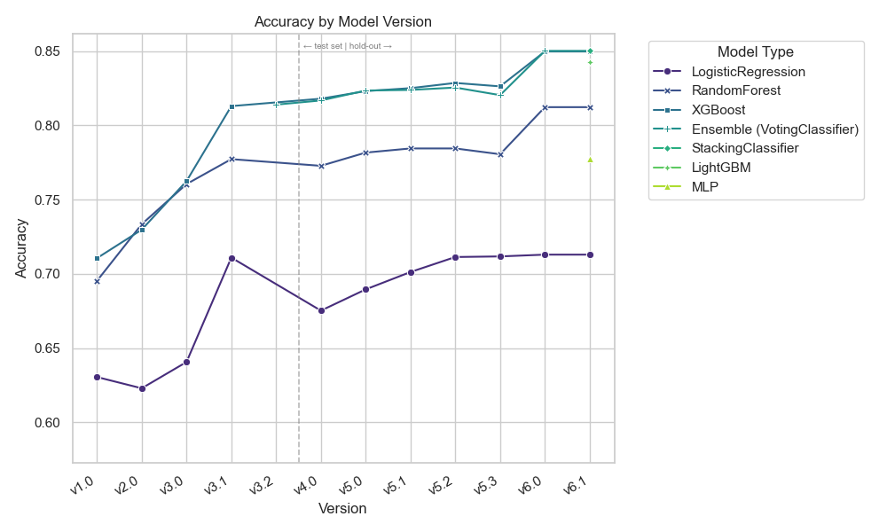
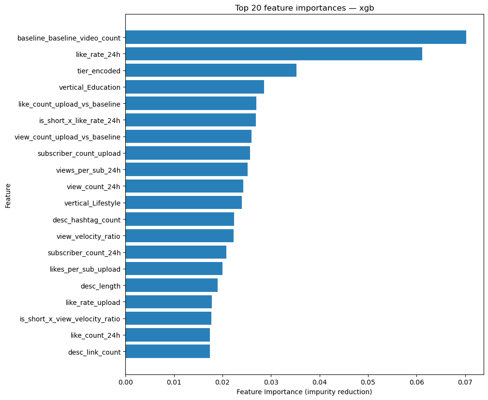
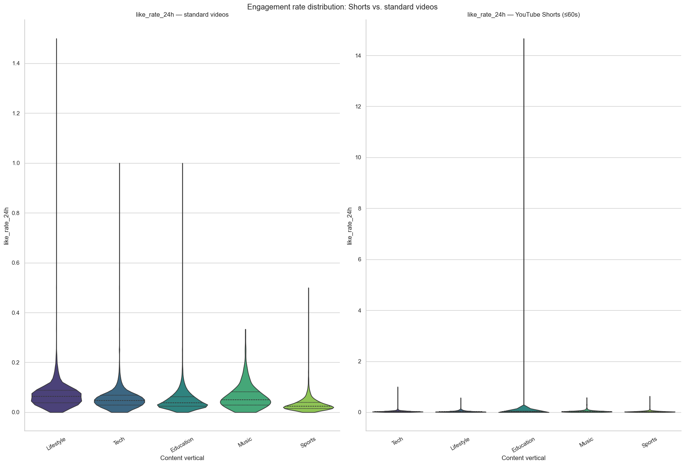

# UC Berkeley Professional Certificate in Machine Learning and Artificial Intelligence — Capstone Project

## Repository Summary

This is my Capstone Project for the 6-month UC Berkeley ["Professional Certificate in Machine Learning and Artificial Intelligence"](https://em-executive.berkeley.edu/professional-certificate-machine-learning-artificial-intelligence) program. The program includes instruction from the UC Berkeley School of Engineering and the UC Berkeley Haas School of Business.

# Predicting Early YouTube Engagement Relative to a Channel's Own Baseline

**Author:** Jelani Gould-Bailey

## **Executive Summary**

When a creator publishes a YouTube video, the first 24 hours are very important. But it is genuinely hard to know, that early, whether the video is on track to do well *for that channel*. This project answers a focused version of that question: **can we predict, using only signals available at upload time and in the first 24 hours, whether a video will beat its own channel's recent engagement track record (median) over its first 7 days?**

The answer is a confident **yes**. Using a custom-built data-collection system running on Google Cloud, I continuously harvested **over 32,000 complete, week-long video histories** — each video observed at three separate points in its life (upload, 24 hours, 7 days) — across **1,375 channels** spanning content categories and audience sizes from 1,000 to 10 million subscribers. On this data I trained and compared **seven different model families** across **51 versioned model snapshots**, with extensive cross-validation and hyperparameter search.

The best model — **XGBoost** — correctly ranks above- vs. below-baseline videos at **0.92 ROC-AUC** on held-out data (where 0.50 is random guessing and 1.0 is perfect), at roughly **84% accuracy**. Critically, when tested on two entire content categories it had *never seen during training* (Music and Sports), it still scored **~0.88 ROC-AUC** — strong evidence it learned something genuine and transferable about early engagement, not just quirks of the categories it trained on.

The single most important predictor turned out to be exactly what the project's design philosophy bet on: **early engagement measured relative to the channel's own norm** (likes-per-hour at the 24-hour mark, normalized against the channel's history and size) is far more predictive than any raw view or like count. The headline business takeaway is that a video's 7-day fate is, to a meaningful and measurable degree, **already visible within 24 hours** — and it is visible in *relative*, channel-aware signals, not absolute popularity.

---

## **Rationale — Why this matters**

**For individual creators**, the 24 hours after upload are a narrow, high-stakes window. If a video is not gaining traction, there is still time to act — refine the title, swap the thumbnail, push it through community posts or social media, or decide to re-upload at a better time. An early, reliable signal of *"this video is tracking below your usual performance"* turns that window from a guess into a decision.

**For a video platform**, the same early signal is valuable in aggregate: it can inform how aggressively to seed a video into recommendations, power creator-facing analytics and coaching tools, and feed longer-term audience-retention forecasting.

The defining design choice — and the thing that makes this useful across the *entire* spectrum of creators — is that every video is judged against **its own channel's recent history**, not against a single global popularity threshold. A 5,000-subscriber education channel and a 5-million-subscriber tech channel live in completely different engagement worlds; a one-size-fits-all threshold would be meaningless for one of them. Benchmarking each video against its own channel's median makes the prediction relevant to a brand-new small creator and an established media brand alike. As a bonus, this framing is **naturally balanced** — by definition roughly half of any channel's videos land above its own median — so we did not have to wrestle with class imbalance.

---

## **Research Question**

*Can we predict whether a YouTube video will achieve above-median engagement within 7 days of publication, using only signals observable at upload time or within the first 24 hours?*

Engagement is defined as `(likes + comments) / views` measured at the 7-day mark, and "above-median" is benchmarked against **that channel's own historical median**, computed from its 30 most recent prior videos (excluding videos used in training). 

This is a **supervised binary classification** problem: the model outputs a probability that a freshly uploaded video will beat its channel's baseline.

---

## **Data Sources**

All data was collected directly from the **YouTube Data API v3** (free tier). Off-the-shelf datasets (e.g. on Kaggle) were unusable for this question for two structural reasons: (1) they lack **time-series snapshots of the same video** at multiple ages, and (2) the **per-channel baseline history** the target is defined against. The YouTube API only ever returns a *current* snapshot of a video — there is no historical record to download — so the only way to obtain a video's trajectory over its first week is to **poll it repeatedly over that week.** That requirement drove the central engineering decision of the project: building a continuous, longitudinal collection system from scratch.

**Channel selection.** Channels were discovered via keyword searches (20 curated queries per content vertical), filtered by subscriber count into three **tiers** — **S** (1K–100K), **M** (100K–1M), **L** (1M–10M) — and screened for a minimum upload velocity (≈ 0.5–1.0 videos/week) so enough data would accrue during the collection window. Each channel is validated before entering the tracking pool, and a candidate buffer in BigQuery ensures an API-quota crash mid-run never loses already-validated channels.

**Baseline data (the benchmark).** When a channel is onboarded, the pipeline pulls its **30 most recent prior videos** and records key statistics to compute that channel's median engagement rate, views, likes, and comments. This happens **once, at onboarding, before any of that channel's videos enter tracking** — so no tracked video can ever contaminate its own benchmark (and there is an explicit gaurdrail in the code to exclude video IDs that are in the longitudinal tracking table). The final baseline dataset spans **40,841 baseline videos across 1,375 channels**.

**Three-snapshot design.** Every tracked video produces exactly three labeled snapshots — `upload` (within ~6 hours of publishing), `24h` (20–30 hours later), and `7d` (156–180 hours later). Only videos observed at **all three** points (a "complete triplet") are usable, because the growth-rate features need all three. The `7d` snapshot provides the answer key (the target); the `upload` and `24h` snapshots provide the inputs. This design *physically enforces* the prediction constraint — no information from beyond 24 hours can leak into the features. At each snapshot the harvester also downloads the thumbnail and extracts computer-vision features (brightness, colorfulness, face presence) with OpenCV, and records YouTube's AI-generated-media flag to allow AI-generated content to be identified / filtered out.

**Scale of the collected data (final snapshot `v3.5_real`):**

| Stage | Volume |
| :---- | :---- |
| Raw poll rows harvested | **106,626** |
| Videos with all three snapshots complete (modelable) | **32,571** |
| Final modeling rows (after baseline-join + cleaning) | **32,126** |
| Channel baselines | 40,841 videos / **1,375 channels** |

So **over 30,000 fully observed, week-long video trajectories** underpin every result below — each one the product of multiple timed API polls rather than a one-shot scrape, accruing at roughly **~300 new videos/day across ~970+ actively tracked channels** for months.

---

## **Methodology**

This section covers both the **data-science methodology** (how the modeling was done) and the **engineering** that made it possible (how the data was harvested and managed at scale).

#### **The data-harvesting engineering**

The dataset is not a static download — it is the output of a **purpose-built, always-on collection system on Google Cloud.** Four independent Cloud Run services cooperate:

| Service | Role |
| :---- | :---- |
| **discovery** | Finds channels to track, tier-aware by subscriber size, with upload-velocity filtering and a candidate buffer so a quota crash never loses validated channels. |
| **harvester** | The core engine. Runs **every 3 hours**, scans tracked channels for new uploads, and polls each video at its three life stages — writing one snapshot row each. Captures views/likes/comments, subscriber count at poll time, thumbnail CV features, duration, category, description, and the AI-media flag. |
| **baselines** | Gathers each channel's last ~30 lifetime videos to compute the channel-relative baseline medians the target is defined against — explicitly excluding any already-tracked video to prevent leakage. |
| **validation** | A health monitor that checks completion rates across all three poll stages and flags gaps. |

This is genuinely **longitudinal** data engineering: a single usable row only exists once a video has been observed at all three points spanning a full week, on top of careful YouTube API quota management (retries disabled, consecutive-error bail-out, per-run quota accounting).

#### **Problem framing & leakage control**

The target, `above_baseline`, is `1` if a video's 7-day engagement rate exceeds its channel's historical median and `0` otherwise. The classes are naturally near-balanced (**~55% above / ~45% below**), so the modeling challenge is *ranking quality*, not imbalance. The prediction constraint is strict: **only upload-time and 24-hour signals may be used as features** — any quantity derived from 7-day data is excluded to prevent leakage, and a correlation-based leakage check (notebook 02) confirms no 7-day information slips in.

#### **Data preparation**

Raw data arrives "long" (up to three rows per video). Preparation is three structural steps — **pivot** long→wide (dropping any video missing a poll), **join** the per-channel baseline medians, and **clean** (whitespace normalization, negative-value clamping, tag normalization). The project **does not impute**: incomplete records are dropped at the stage that introduces the gap, because they are structurally — not randomly — missing.

The modeling table is split with **stratification on an 18-cell `vertical × tier × above_baseline` key**, so every segment is represented proportionally in every partition. Starting at model generation v4.0, a **30% holdout validation set was created once and locked** (its video IDs persisted to cloud storage) so that *every* later version is scored on the identical set — making cross-version comparison exact rather than an artifact of a lucky re-split. The remaining data is split 80/20 into train/test each run, and all features are standardized with a scaler fit only on the training split.

> Early generations (v1.0–v3.1) supplemented limited real data with **synthetic augmentation** (SDV's `GaussianCopulaSynthesizer`), added to the *training split only*, in order to give those models enough data to adequately train. Once the real dataset was large enough (v4.0+), training switched to **100% real data**.

#### **Feature engineering**

Raw counts are heavily right-skewed and not comparable across channels of different sizes (see EDA below). Feature engineering converts them into **scale-invariant, channel-relative signals** that are both more predictive and more linearly separable. The set grew across generations to **55 model-ready features** in six families:

- **Engagement velocity & acceleration** — how fast views/likes accumulate in the first 24h, including subscriber-normalized and ratio-to-channel-norm variants.
- **Baseline-comparison features** — early metrics expressed relative to the channel's own historical median.
- **Normalized engagement rates** — likes/comments as a fraction of views (introduced in v3.1; the single largest model improvement in the project).
- **Content & metadata** — duration, `is_short`/`is_long`, title/description pattern categories, text-structure metrics, thumbnail CV features, and publish-time features.
- **Subscriber-normalized metrics** — for fair comparison across very different audience sizes.
- **Segment encodings** — `tier_encoded` and one-hot vertical indicators (among the strongest predictors).

##### **Modeling**

Seven model families were trained and compared, spanning the interpretability ↔ performance trade-off:

- **Logistic Regression (L1/ElasticNet)** — the interpretable, linear baseline.
- **Random Forest** and **XGBoost** — non-linear tree models with feature-importance rankings.
- **LightGBM** — a second gradient-boosting implementation (an independent cross-check on XGBoost).
- **MLP** — a small neural network.
- **Voting ensemble** (RF + XGB, soft vote) and a **Stacking ensemble** (RF + XGB + LGB → logistic meta-learner, 5-fold CV).

Hyperparameters were tuned with **`RandomizedSearchCV` (100 iterations × 5-fold cross-validation, ROC-AUC scoring)** on the leading candidates — thousands of underlying fits. Across the full project this amounts to **51 versioned model snapshots over 13 versions**, with v4.0+ versions all scored on the same locked holdout. All artifacts — data snapshots, models, scalers, feature lists, hyperparameters, and validation results — are versioned and stored in GCS for reproducibility.

##### **Evaluation metric — and why**

The metric of record is **ROC-AUC**: it measures how well a model *ranks* above-baseline videos over below-baseline ones across all decision thresholds, independent of where the cutoff is set. This fits the business use case (flagging likely over/under-performers is fundamentally a ranking task) and the naturally balanced target. **Accuracy** and **F1 (above-baseline class)** are reported alongside for completeness, since the costs of the two error types differ.

---

#### **Exploratory Data Analysis — what the raw data looks like**

A few findings from the raw and engineered data shaped every downstream choice.

**1. Raw engagement is power-law skewed.** A handful of viral videos receive orders of magnitude more views than the median, producing a long right tail. These outliers are **retained** — they are real events, not errors, and removing them would distort the channel-relative baseline. The tree models are robust to them, and the engineered ratios compress them.

**2. Raw counts are not comparable across content categories.** View velocity differs by an order of magnitude across verticals — direct evidence that absolute counts are the wrong unit, and motivation for normalizing every signal against the channel's own baseline.

**3. Feature engineering makes the signal usable.** Dividing two power-law quantities (e.g. likes ÷ views) yields a near-log-normal, far more symmetric distribution — which is exactly what makes the engineered features more predictive and more linearly separable than the raw counts they come from. (See [02 · Feature Engineering + Engineered-Data EDA](./src/capstone/notebooks/02_feature_engineering_eda.ipynb) for the detailed before/after distribution plots.)

**4. Class balance across tiers + verticals:**
The target is near-balanced overall but varies in structured ways by vertical and tier — validating the stratified split key.

---

## **Results**

#### **The hypothesis holds — early signal predicts 7-day relative performance.**

On the locked, in-distribution validation set (5,192 videos, model version **v6.2**), the final candidates land as follows:

| Model | ROC-AUC | Accuracy | Precision (macro) | Recall (macro) | F1 (macro) | F1 (above) | F1 (below) |
| :---- | :----: | :----: | :----: | :----: | :----: | :----: | :----: |
| **XGBoost** | **0.920** | 0.843 | 0.842 | 0.840 | 0.841 | 0.861 | 0.821 |
| Stacking ensemble | 0.920 | 0.843 | 0.842 | 0.840 | 0.841 | 0.860 | 0.821 |
| LightGBM | 0.919 | 0.844 | 0.843 | 0.840 | 0.842 | 0.862 | 0.821 |
| Voting ensemble | 0.917 | 0.841 | 0.840 | 0.837 | 0.838 | 0.859 | 0.817 |
| Random Forest | 0.886 | 0.806 | 0.808 | 0.798 | 0.801 | 0.833 | 0.769 |
| MLP | 0.850 | 0.774 | 0.771 | 0.770 | 0.770 | 0.797 | 0.744 |
| Logistic Regression | 0.768 | 0.704 | 0.700 | 0.697 | 0.698 | 0.738 | 0.658 |

*Macro precision/recall/F1 are the unweighted mean across both classes; per-class F1 is reported for the above- and below-baseline classes separately because the two error types carry different business costs. Because the target is near-balanced, macro and weighted averages are nearly identical here.*

The four strongest models finish **within ~0.003 ROC-AUC of one another** — a near-tie well inside run-to-run noise.

## **What the model learned — and why it validates the project's core bet.**

Across XGBoost, LightGBM, and Random Forest the dominant predictor is **`like_rate_24h`** (likes-per-hour at the 24-hour mark) — the cleanest early-momentum signal — followed by channel-context features: baseline video count, subscriber tier, and baseline-normalized view/like ratios. The progression of feature importance across versions tells the story: the earliest models leaned on **raw counts**; the mature models lean on **channel-relative, normalized signals**. In plain terms: *how a video is doing relative to its own channel's norm, in the context of what kind of channel it is*, beats any absolute engagement number. That is precisely the design philosophy the project was built around.

`is_short` (whether a video is a YouTube Short) has been a top feature since early generations, reflecting that Shorts have fundamentally different engagement dynamics from standard videos — a threshold effect a raw count cannot capture.

## **The decisive finding: a real generalization test, and a structural ceiling.**

Two results elevate this from "a model that works" to "a model we understand."

**(a) It generalizes to content categories it never trained on.** The models were trained only on **Tech, Lifestyle, and Education**. In the late stages of the project, I deliberately pointed the collection system at two **held-out categories the model would never train on — Music and Sports** — and walled their videos off entirely. Evaluated on these **2,447 never-seen videos**, the model still scored **~0.88 ROC-AUC** — a graceful, predictable ~0.04 drop, not a collapse. This is a much harder test than a normal holdout ("unseen videos from seen channels"); it asks "does the model work on **entire categories it has never encountered?"** — and the answer is **yes**. This out-of-bounds test was also the **tiebreaker that selected XGBoost:** XGB posted the best out-of-distribution ranking *and* the smallest generalization gap, while LightGBM's in-distribution edge did not transfer and the stacking ensemble added complexity for no out-of-distribution benefit. XGBoost is therefore the **strongest generalizer, the simplest performant option, and fully interpretable** — making it the ideal final model for this project.

| Model | OOB ROC-AUC (Music/Sports) | Generalization gap (OOB − in-distribution) |
| :---- | :----: | :----: |
| **XGBoost** | **0.880** | **−0.041** (smallest) |
| Stacking ensemble | 0.878 | −0.043 |
| LightGBM | 0.875 | −0.043 |

*A smaller (closer-to-zero) gap means the model degrades less on categories it never saw. XGBoost wins both columns — the decisive evidence for the final choice.*

**(b) Performance is bounded by the signal, not the model.** Four independent lines of evidence converge on a **structural ceiling at ~0.92 ROC-AUC in-distribution**:

1. More data, more features, more model families, and extensive tuning have **barely moved** in-distribution ROC-AUC since the gradient-boosting models matured.
1.  Two independent gradient-boosting implementations (XGBoost and LightGBM) **converge to nearly identical scores**, and stacking them adds essentially nothing — when different implementations of the same idea, and ensembles of them, all land in the same place, it points to limits in the *signal*, not the model.
1.  The Logistic Regression model sits **~0.15 AUC below** the tree models and never closes the gap — confirming the signal is genuinely non-linear and not a good fit for Logistic Regression, structurally.
1.  The out-of-bounds test settles at a consistent ~0.88 — a clear, repeatable upper bound.

Knowing **where the ceiling is and why** is itself a defensible scientific conclusion: future gains will come from **richer features, not more models.**

This conclusion was the result of rigorous testing. The single consistent blind spot is **small channels (tier=S)**, where every tree model drops ~0.04 AUC (XGB **0.88 on tier=S** vs. 0.92 global). Two model-side fixes were built, tested, and **rejected**: per-tier specialized sub-models *backfired* (splitting the data cost signal), and up-weighting small-channel rows only dragged the global score down to meet S. The reason is fundamental: small channels simply carry **noisier signal**, and a rank-based metric cannot manufacture separability that the data does not contain. The tier=S ceiling is **intrinsic**, and the only real remaining lever is feature-side (encoding baseline *reliability*).

---

#### **Known Limitations**

- **Small-channel (tier=S) blind spot** (~0.04 AUC below global) — proven intrinsic to low-volume channel data, not fixable model-side.
- **Out-of-distribution drop** (~0.04 AUC) — real but graceful; categories far from the trained three should be treated as lower-confidence until represented in training.
- **Small margins between top candidates** (~0.002–0.004 AUC) — the XGBoost choice is *directionally* robust (it wins both OOB ranking and generalization gap), but bootstrap confidence intervals would firm up the point estimates.
- **Possible residual synthetic content** — YouTube's AI-media flag is captured and filtered, but undetected AI-generated content may remain, with unknown effects on engagement dynamics.

---

#### **Next Steps**

**Near-term (no new data collection required):**

- **Feature-side reliability encoding for small channels** — the variance/dispersion of baseline rates, not just their median — the one lever left for the tier=S ceiling.
- **Log-transform the remaining raw absolute-count columns** — the derived velocity and subscriber-normalized features are already `log1p`-compressed, but the raw upload/24h view, like, and comment counts still enter the model untransformed; bringing them onto a log scale may help the linear model in particular.
- **Within-vertical duration percentile** — "long" means something different per category; relative positioning is more meaningful than a global threshold.
- **Operating-threshold tuning for tier=S** — since the limitation is separability, not calibration.

**Longer-term (requires new data collection):**

- **Broaden out-of-bounds coverage** as the Music/Sports set grows, and fold additional verticals into training as data accrues. (A further ~1k real triplets are expected in June 2026).
- **Richer thumbnail signals** beyond brightness/colorfulness/faces — e.g. text-overlay detection, common in Shorts and educational content.
- **Bootstrap confidence intervals** on the validation and OOB tables, so the final comparison rests on intervals rather than point estimates.

---

## **Outline of Project: Notebooks**

The notebooks used in this project form a numbered sequence; see the [notebook guide](./src/capstone/notebooks/notebooks.md) for how they fit together and when to run each.

- [01 · EDA — Raw Data](./src/capstone/notebooks/01_eda_raw_data.ipynb)
- [02 · Feature Engineering + Engineered-Data EDA](./src/capstone/notebooks/02_feature_engineering_eda.ipynb)
- [03 · Model Training + Results](./src/capstone/notebooks/03_model_training_results.ipynb)
- [04 · Hyperparameter Tuning](./src/capstone/notebooks/04_hyperparameter_tuning.ipynb)
- [05 · Final Model Selection + Results](./src/capstone/notebooks/05_final_model_selection.ipynb)

Additional technical documentation and project documentation can be found in the [docs](docs/) folder.

---

#### **Engineering & Code Organization**

Beyond the modeling, this project was a substantial engineering effort: **over 7.3k lines of Python code across 40 modules, deployed to production** (excluding the analysis notebooks, blank lines, and comments). The two largest components are the **data-collection services** (~1,450 lines) that harvest the longitudinal dataset, and the **modeling pipeline** (~3,140 lines) that turns it into versioned results.

The code is backed by **215 unit tests across 13 test modules** (~1.7k lines), run as a gate before every push to the repository. Coverage is concentrated on the correctness-critical logic — data cleaning, feature engineering, the train/test/validation splitter, snapshotting, and the tier-modeling experiments — rather than the thin I/O wrappers; roughly 40% of modules have a dedicated test module, weighted toward the parts where a silent bug would corrupt results.

Analysis and decision-making happens in modular, purpose-built [notebooks](notebooks/) that share state through versioned GCS Parquet snapshots rather than passing DataFrames in memory — keeping implementation code separate from the write-up, letting each stage re-run independently, and managing performance (early tuning runs exceeded 30 minutes). The underlying package implements a `PipelineRun` dataclass (typed state carrier), a `PipelineFactory` (assembles stages per scenario), and stage classes for loading, preprocessing, feature engineering, splitting, scaling, augmentation, training, validation, and snapshotting. The data-collection services (`harvester`, `baselines`, `discovery`, `validation`) run as separate services in GCP, fully decoupled from the modeling pipeline. Every model artifact and data snapshot is versioned semantically (e.g. `v6.2`) and stored in GCS for reproducibility.

---

##### **License**

This project is licensed under the [MIT License](./LICENSE).

---

##### **Contact and Further Information**

Jelani Gould-Bailey · [LinkedIn](https://www.linkedin.com/in/jelani-gould-bailey/) · [GitHub Repository](https://github.com/jelani-gb/capstone)
