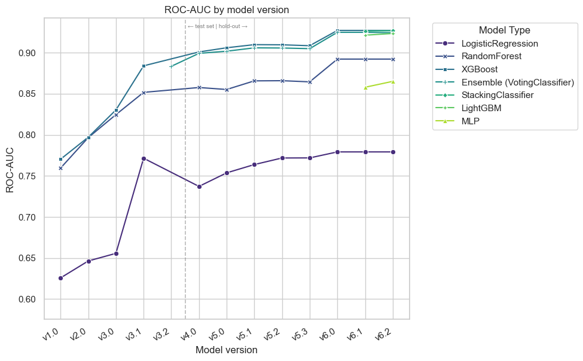
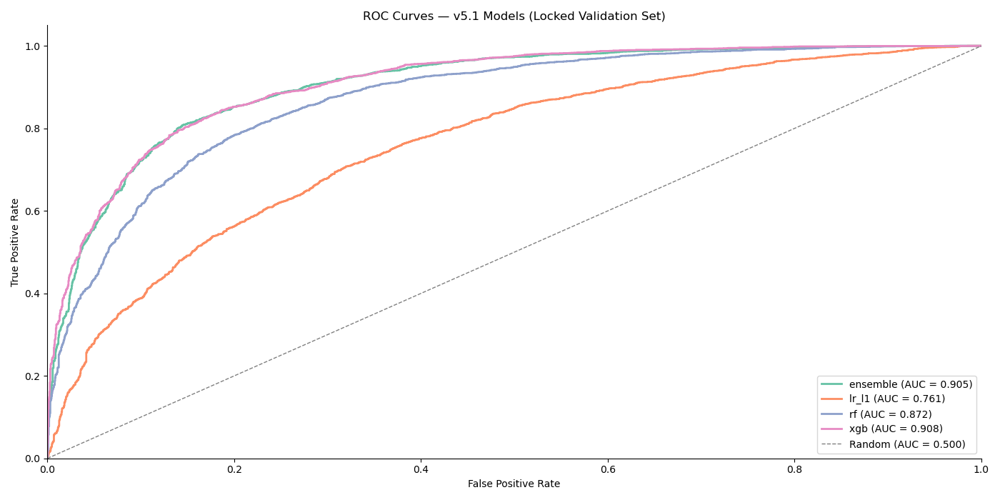
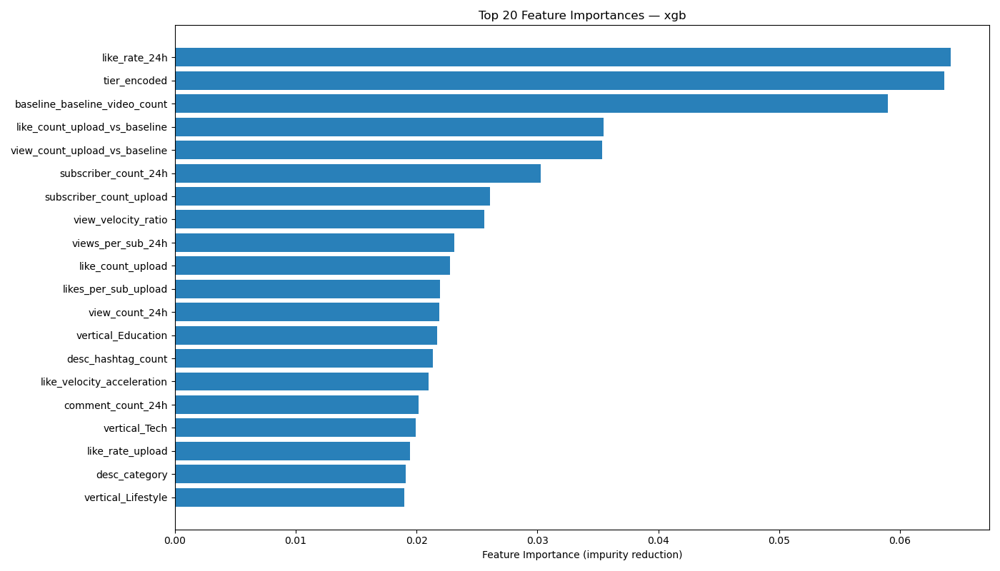
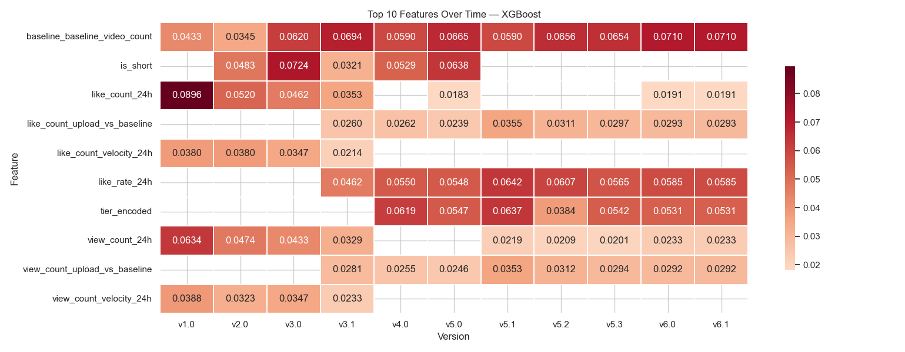

# UC Berkeley Professional Certificate in Machine Learning and Artificial Intelligence \- Capstone Project

## Repository Summary

This is my Capstone Project for the 6-month "Professional Certificate in Machine Learning and Artificial Intelligence" program. The program includes instruction from the UC Berkeley School of Engineering and UC Berkeley Haas School of Business.

---

## Capstone Project

## **Author:** Jelani Gould-Bailey

#### **Executive Summary**

This project investigates whether a YouTube video's engagement performance — measured relative to that channel's own historical baseline — can be reliably predicted within the first 24 hours of publication using only publicly observable signals. Using a custom-built data collection pipeline running on Google Cloud Platform, I assembled a dataset of over 17,000 complete video snapshots at upload, 24h and 7d intervals. These videos were sourced from 974 channels spanning three content verticals (Education, Lifestyle, Tech) and three subscriber tiers. Three classifier families were trained and evaluated across five model generations: Logistic Regression with L1 regularization, Random Forest, and XGBoost. The final XGBoost model achieved **0.908 ROC-AUC** on a locked holdout validation set. The \~15-point ROC-AUC performance gap separating it from Logistic Regression demonstrates that YouTube engagement dynamics are fundamentally non-linear: driven by threshold effects (e.g. the abrupt behavioral cliff between YouTube Shorts and standard videos at the 60-second duration boundary) and channel-contextual interactions (e.g. a 5% 24-hour like rate signaling very different things for a 10K-subscriber channel than for a 1M-subscriber channel) that a linear model cannot capture regardless of tuning.

---

#### **Rationale**

For individual YouTube creators, the 24 hours immediately following a video upload are critical. If a video is not gaining traction early, there is often a narrow window to act — adjusting the title, updating the thumbnail, pushing the video in community posts or on social media, or deciding to re-upload. 

For a video platform, early engagement prediction can inform recommendation seeding, creator support tooling, and long-term retention forecasting. A model that flags — within the first 24 hours — whether a video is likely to underperform relative to a creator's own historical baseline is immediately actionable for both the creator and the platform, giving an early indication of where engagement will land in 7d. 

The core design choice this project — benchmarking against a *channel's own* historical median rather than a global threshold — makes this problem meaningful across the full spectrum of creator sizes. A 5,000-subscriber education channel and a 5-million-subscriber tech channel face completely different engagement landscapes; a global threshold would be uninformative for one of them. By design, 50% of any channel's videos will land above its own median, which also eliminates class imbalance as a modeling concern from the outset.

---

#### **Research Question**

*Can we predict whether a YouTube video will achieve above-median engagement within 7 days of publication, using only signals observable at upload time or within the first 24 hours?*

Engagement is defined as `(likes + comments) / views` at the 7-day mark, benchmarked against that channel's own historical median computed from its 30 most recent prior videos.

---

#### **Data Sources**

All data is collected via the YouTube Data API v3 (free tier). Rather than relying on existing Kaggle datasets — which lack the time-series structure and channel-level baseline data this problem requires — I built a custom harvesting pipeline from the ground up.

**Why custom collection?** The central design challenge is that predicting whether a video beats its own channel's historical median requires two things unavailable in any pre-built dataset: (1) time-series snapshots of the *same video* at multiple points in time, and (2) a channel baseline built from the channel's recent upload history. Calls to the YouTube API will return a current snapshot of data for any given video\_id; there are no publicly available APIs to track performance over time. Because this project required tracking metric changes over time, a custom tracking pipeline was built.

**Channel selection.** Channels were discovered using keyword searches across 20 curated search queries per vertical, filtered by subscriber count into three tiers (S: 1K–100K, M: 100K–1M, L: 1M–10M), and screened for minimum upload velocity (at least 0.5–1.0 videos per week, depending on tier) to ensure sufficient data accrual during the data collection period. Each channel is validated before being added to the tracking pool, and a candidate buffer table in BigQuery prevents quota crashes from losing discovered channels mid-run.

**Baseline data.** When a channel is first onboarded, the pipeline collects the 30 most recent videos from that channel's upload history via the YouTube API's `playlist` endpoint and records their lifetime statistics. These videos become the basis for computing per-channel median engagement rate, median views, median likes, and median comments. This baseline collection happens *once at onboarding*, before any videos from that channel enter the tracking pool, ensuring no tracked video can influence its own benchmark.

**Three-snapshot design.** Each tracked video produces exactly three labeled snapshots — `upload` (within 6 hours of publish), `24h` (between 20–30 hours post-publish), and `7d` (between 156–180 hours post-publish) — stored as rows in a `video_snapshots` table in BigQuery. Only videos with all three snapshots (a "complete triplet") are used for modeling. The `7d` snapshot provides the ground truth for the target variable; the `upload` and `24h` snapshots provide the features. This design enforces the prediction constraint: no information from beyond 24 hours is available as input to the model. At each snapshot, in addition to engagement metrics, the harvester downloads the video thumbnail and extracts computer vision features (brightness, colorfulness, face detection) using OpenCV.

**Pipeline architecture.** A data harvester script polls the API  every 3 hours, scanning all tracked channels for new videos and recording upload snapshots. Those same videos are tracked for 24-hour and 7-day follow-up polls. A nightly baseline polling script onboards newly discovered channels and computes their historical medians. 

**Scale.** The dataset spans 974 channels across 3 content verticals and 3 subscriber tiers. The channels are spread across tiers in the following distribution for each vertical: 75 L, 100 M, 150 S. For the lifestyle vertical there was a duplicate channel detected during analysis, resulting in 974 total distinct channels. 

---

#### **Methodology**

##### **Problem Statement**

This is a **supervised binary classification** problem. The target variable, `above_baseline`, is 1 if a video's 7-day engagement rate `(likes + comments) / views` exceeds that channel's historical median engagement rate, and 0 otherwise. Benchmarking against the channel's own median is a deliberate design choice that naturally balances the classes — by definition, roughly 50% of a channel's videos exceed its own median — and makes the model applicable across channels of any size without requiring a global engagement threshold.

The prediction constraint is strict: only signals observable at upload time or within the first 24 hours may be used as features. Any metric derived from 7-day data is excluded from the feature set to prevent data leakage.

##### **Data Preprocessing and Preparation**

Raw data arrives in long format from BigQuery — up to three rows per video, one per snapshot label. Preprocessing follows three steps: **pivoting** from long to wide format (dropping any video that does not have all 3 poll labels), **joining channel baseline medians** from a separate baseline table onto each video record, and **structural cleanup** — whitespace normalization, negative value clamping, and tag field normalization.

The final modeling table uses a stratified split on `vertical × tier × above_baseline` (18 cells) to ensure all segments are represented proportionally in every partition. Starting with model generation v4.0, a **30% holdout validation set** was created once and locked — with its video IDs persisted to GCS — to enable apples-to-apples comparisons across all subsequent model versions. The remaining 70% is split 80/20 into training and test sets at each run. All features are standardized using `sklearn`'s `StandardScaler` fit on the training set and applied to all splits.

Early model generations (v1.0–v3.1) used synthetic data augmentation via SDV's `GaussianCopulaSynthesizer` to supplement limited real data. Synthetic rows were assigned to real channel IDs (inheriting that channel's actual baseline medians to produce realistic target labels) and appended to the training split only — never to validation or test. Starting with v4.0, the real dataset was large enough to train exclusively on real data.

##### **Feature Engineering**

The project evolved through multiple distinct feature generations, growing from 39 to 53 columns. Features fall into six categories.

**Engagement velocity and acceleration** capture how quickly views and likes are accumulating in the first 24 hours. This includes raw upload-to-24h velocity (`view_count_velocity_24h`, `like_count_velocity_24h`), upload-time momentum (`view_velocity_upload`, `like_velocity_upload`), subscriber-normalized velocity to remove channel-size bias (`view_velocity_per_sub_24h`), a velocity ratio expressing momentum relative to the channel's typical view count (`view_velocity_ratio`), and second-order acceleration features (`view_velocity_acceleration`, `like_velocity_acceleration`).

**Baseline comparison features** (`view_count_upload_vs_baseline`, `like_count_upload_vs_baseline`) express a video's early metrics relative to the channel's own historical median — capturing whether early performance is tracking above or below what that channel typically sees at the same point in a video's lifecycle.

**Normalized engagement rates** (`like_rate_upload`, `like_rate_24h`) express likes as a fraction of views, removing the influence of channel size that raw like counts carry. These features, introduced in v3.1, produced the largest single-generation model improvement in the project.

**Content and metadata features** include video duration (`duration_seconds`, `is_short`, `is_long`, `duration_bucket`), title and description pattern categories encoded as ordinal integers from a priority-ordered classification scheme (e.g., question, listicle, clickbait, neutral), text structural metrics (title length, word count, tag count, description link and hashtag counts), thumbnail features (brightness, colorfulness, face presence as a binary flag), and temporal features (publish hour, day of week, weekend flag).

**Subscriber-normalized metrics** (`views_per_sub_upload`, `likes_per_sub_24h`, etc.) allow fair comparison of engagement volume across channels with very different audience sizes.

**Segment encodings**, added in v4.0, include `tier_encoded` (ordinal: S=0, M=1, L=2) and one-hot vertical indicators (`vertical_Education`, `vertical_Lifestyle`, `vertical_Tech`). These proved to be among the strongest predictors in the final model.

Three features present in v1.0 were removed through iterative cleanup: `face_count` (replaced by the more reliable binary `has_face`), `hours_since_publish_upload` (identified as a harvester timing artifact, not a content signal), and `duration_minutes` (redundant with `duration_seconds`).

##### **Modeling**

Three classifier families were selected to span the interpretability–performance tradeoff.

**Logistic Regression with L1 regularization** serves as the interpretable baseline. Its coefficients are directly readable as feature weights, and L1 regularization performs implicit feature selection by zeroing out low-signal features. Its performance ceiling is limited structurally by its inability to capture non-linear feature interactions.

**Random Forest** handles non-linear relationships and categorical variables naturally, provides feature importance rankings via impurity reduction, and is robust to outliers and correlated features. It is itself an ensemble of decision trees, so its variance is lower than a single tree at the cost of interpretability.

**XGBoost** (gradient-boosted trees) provides the strongest predictive performance. It builds trees sequentially, with each tree correcting residuals from the prior, and applies built-in L1/L2 regularization. Both RF and XGB are used to generate feature importance rankings.

A **VotingClassifier ensemble** combining RF and XGB (soft voting, weights 1:2 in favor of XGB) was also evaluated. While RF and XGB are each already ensemble methods internally, combining them tests whether the two model families capture complementary signal. The near-zero gain from ensembling (XGB 0.908 vs. Ensemble 0.905 on the validation set) confirmed they are largely capturing the same patterns, supporting XGBoost as the primary model for ongoing work rather than the more complex ensemble.

Hyperparameter tuning was performed using `RandomizedSearchCV` (100 iterations, 5-fold CV, ROC-AUC scoring) across all three base models. The best XGBoost configuration used 1,500 estimators, a learning rate of 0.05, max depth of 6, and explicit regularization (`reg_alpha=1`, `reg_lambda=5`). All model artifacts — trained models, scalers, feature column lists, hyperparameters, and per-run validation results — are versioned and stored in GCS for reproducibility.

##### **Model Evaluation**

The primary evaluation metric is **ROC-AUC**, which measures a model's ability to rank positive (above-baseline) examples above negative ones across all classification thresholds. Given that classes are naturally balanced at roughly 50/50, accuracy is also reported. F1 score for the above-baseline class provides a balanced view of precision and recall.

Starting with v4.0, all evaluations were performed on the locked holdout validation set, making cross-generation comparisons reliable. For v1.0–v3.x, test sets were freshly re-split at each run — a limitation acknowledged when interpreting the generational AUC trend.

**AUC progression across model versions:**

| Version | Data composition (real / synthetic) | Features | LR AUC | RF AUC | XGB AUC |
| :---- | :---- | :---- | :---- | :---- | :---- |
| v1.0 | Mixed (66% real) | 39 | 0.626 | 0.760 | 0.770 |
| v2.0 | Mixed (70% real) | 39 | 0.646 | 0.797 | 0.797 |
| v3.0 | Mixed (80% real) | 36 | 0.657 | 0.825 | 0.830 |
| v3.1 | Mixed (80% real) | 50 | 0.772 | 0.852 | 0.884 |
| V4.0 *(locked val)* | 100% real | 53 | 0.737 | 0.858 | 0.901 |
| v5.1 *(locked val)* | 100% real, tuned | 53 | 0.761 | 0.872 | **0.908** |

The RF and XGB trajectories are monotonically increasing across every generation. The largest single-generation jump — XGB \+5.4 AUC points, LR \+11.5 points — came with the v3.1 feature engineering release, which introduced normalized engagement rates (`like_rate_24h`) and baseline comparison features. The improvement to LR was disproportionately large because these new features are more linearly separable with respect to the target; `like_rate_24h` became the top feature by coefficient in the LR model.

The apparent LR regression from v3.1 (0.772) to v4.0 (0.737) reflects two simultaneous changes: the removal of synthetic data augmentation and a near-doubling of the training set with new real channels. Logistic Regression is more sensitive to distributional shifts in training data than tree models, and the synthetic data had provided a smoothing effect on class boundaries. With real-only data at higher volume, the class boundaries become less clean — more noise, more edge cases — and LR's structural inability to model non-linearities becomes more apparent. An unusually large coefficient on `like_count_upload_vs_baseline` in v4.0 LR suggests the model is over-relying on a single feature, consistent with multicollinearity issues. Hyperparameter tuning in v5.1, which adopted an ElasticNet penalty and a narrowed regularization grid, partially recovered the v3.1 performance.

The RF and XGB improvements from v4.0 to v5.1 are attributable to targeted hyperparameter tuning and modest dataset growth. The fact that both tree models continued to improve while LR did not — despite all models receiving the same tuning treatment — confirms that the performance gap between LR and the tree families is structural rather than a data quantity or tuning issue.

---

#### **Results**

The final XGBoost model (v5.1, evaluated on the locked 5,193-video holdout) achieved **0.908 ROC-AUC**, **82.8% accuracy**, and an **F1 score of 0.847** for the above-baseline class. Random Forest reached 0.872 AUC with comparable accuracy. The VotingClassifier ensemble of RF and XGB matched XGBoost almost exactly (0.905 AUC), confirming that XGBoost alone is the recommended primary model — the ensemble adds complexity without meaningful performance gain.

Logistic Regression reached 0.761 AUC after tuning. The approximately 15-point gap between LR and the tree models is the headline finding of the modeling comparison: **YouTube engagement prediction is a non-linear problem**. Title characteristics, content format, early velocity, and channel-tier context interact in ways that a linear decision boundary cannot represent. The gap is consistent across every model generation and persists regardless of regularization strategy.

**What the model learned — feature importance evolution across generations:**

The shift in feature importance rankings across generations is as informative as the AUC numbers themselves. In the earliest model versions (v1.0–v2.0), raw engagement counts dominated — `like_count_24h` and `view_count_24h` occupied the top positions. As the feature set evolved, the rankings shifted in two meaningful waves.

The first shift came in v2.0–v3.0, when `is_short` rose to the top feature by XGBoost importance (0.072 in v3.0). This indicates that YouTube Shorts exhibit engagement dynamics sufficiently different from standard videos that content format is the most predictive single feature available at that stage — a threshold effect that a raw count feature cannot capture.

The second and larger shift came in v3.1, when normalized and channel-contextual features were introduced. `like_rate_24h` became the dominant signal in both LR and RF, while `baseline_baseline_video_count` emerged as a consistent top-three feature — suggesting that how established and active a channel is affects the predictability of any given video's performance.

By v4.0, the top four XGBoost features were: (1) `tier_encoded` — a channel's subscriber tier is the single strongest predictor; (2) `baseline_baseline_video_count` — channel history and volume; (3) `like_rate_24h` — normalized 24-hour engagement quality; and (4) `is_short` — content format. The pattern is clear: *how a video is performing relative to that channel's norm, in the context of what kind of channel it belongs to,* is more predictive than any absolute engagement metric. This directly validates the channel-baseline design philosophy of the project.

---

#### **Next Steps**

**Near-term feature engineering (no new data collection required):**

*Log-transforming count features.* Raw engagement counts — view counts, like counts, comment counts — follow heavy-tailed power-law distributions on YouTube. A handful of viral videos receive orders of magnitude more views than the median, and `StandardScaler` normalizes mean and variance but does not correct the underlying distributional skew. Log-transforming these features before scaling would reduce the distorting effect of outliers and is likely to improve Logistic Regression performance meaningfully, while also benefiting the tree models at the margins. This is the lowest-cost, highest-expected-impact change available without touching the data collection pipeline.

*`is_short` interaction features.* `is_short` has been a top-5 feature since v2.0 and currently ranks \#4 in XGBoost v4.0. YouTube Shorts exhibit fundamentally different viewer behavior — they are typically watched multiple times in a feed without likes, distributed through a separate recommendation system, and benefit from different algorithmic visibility mechanics than standard videos. A model applying the same engagement rate interpretation to a Short and a 20-minute video is making an implicit categorical error. Candidate interactions include `is_short × like_rate_24h` (engagement rate means something different for Shorts), `is_short × view_velocity_ratio` (momentum growth patterns differ by format), and a `like_rate_short` feature (like\_rate\_24h where is\_short=1, else 0\) to allow the model to learn separate engagement thresholds per content type.

*Within-vertical duration percentile.* The current `is_short` and `is_long` flags use global thresholds (under 60 seconds; over 20 minutes), but "long" means something different depending on vertical. A 15-minute video is standard for Education channels but above-average for Lifestyle. Computing a `duration_percentile_within_vertical` — where does this video fall in the duration distribution for its own vertical — would capture relative positioning rather than absolute length, making the feature more semantically meaningful across verticals.

*Engagement rate momentum.* The pipeline already computes velocity and acceleration features for raw counts. An analogous feature for the engagement rate itself — the ratio `like_rate_24h / like_rate_upload`, expressing how much engagement density changed in the first 24 hours — could be a meaningful additional signal for identifying videos building genuine engaged audiences versus those accruing passive views.

*Segment analysis.* The current global model learns a single approximation across vertical/tier cells that have meaningfully different engagement dynamics. A natural next step is evaluating model performance across specific verticals and also across each size tier. This evaluation could reveal a basis for separate per-vertical or per-tier models.

**Longer-term (requires new data collection):**

Adding new signals to the pipeline requires re-engineering the harvesting scripts, redeploying Cloud Run services, and waiting multiple weeks for sufficient new complete triplets to accrue with the new fields — the same pace at which the current \~17,000 triplets were collected. Given that investment, longer-term additions should be prioritized carefully. The highest-potential candidates are richer thumbnail signals beyond brightness, colorfulness, and face count — for example, whether the thumbnail contains text overlay, a common pattern in Shorts and educational content that the current feature set cannot detect.

---

#### **Project Notebooks**

- [Exploratory Data Analysis](./src/capstone/notebooks/eda.ipynb)  
- [Model Training](./src/capstone/notebooks/retrain_models.ipynb)  
- [Hyperparameter Tuning](./src/capstone/notebooks/hyperparam_tuning.ipynb)  
- [Model Results Analysis](./src/capstone/notebooks/model_results_analysis.ipynb)

---

#### **Design Notes & Code Organization**

As the project size grew, splitting the work into modular, purpose-built notebooks proved essential. EDA, model training, and hyperparameter tuning each have their own notebooks, sharing state through versioned GCS Parquet snapshots rather than passing DataFrames in-memory. This separation keeps implementation code separate from results write-up, allows each stage to be re-run independently, and was necessary for performance management — early hyperparameter tuning runs took over 30 minutes per execution.

The underlying Python code is organized into a `pipeline/` package that implements a `PipelineRun` dataclass (typed state carrier), a `PipelineFactory` (assembles stages per run scenario), and a set of stage classes covering data loading, preprocessing, feature engineering, splitting, scaling, augmentation, training, validation, and snapshotting. Data collection scripts (`harvester`, `baseline harvester`, `channel discovery`) run as separate Cloud Run services and are entirely decoupled from the modeling pipeline. All model artifacts and data snapshots are versioned semantically (e.g., `v5.1`) and stored in GCS for reproducibility.

---

#### **Capstone Project Week 20 Check-In**

For the Week 20 check-in, please review the [Exploratory Data Analysis](./src/capstone/notebooks/eda.ipynb) and [Model Results Analysis](./src/capstone/notebooks/model_results_analysis.ipynb) notebooks.

---

#### **Capstone Project Week 24 Final**

Pending

---

##### **Contact and Further Information**

Jelani Gould-Bailey · [GitHub Repository](https://github.com/jelani-gb/capstone)
